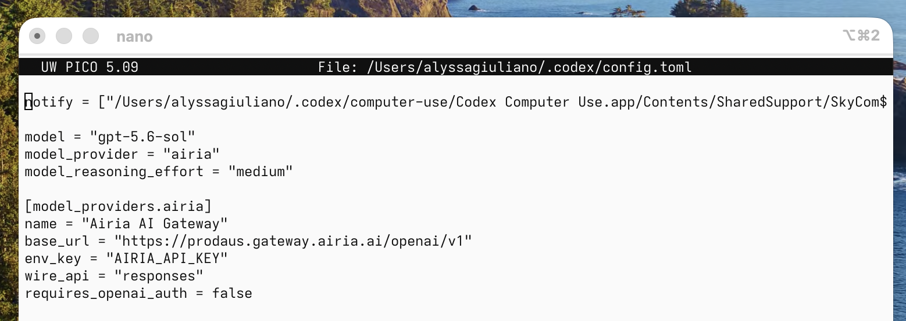
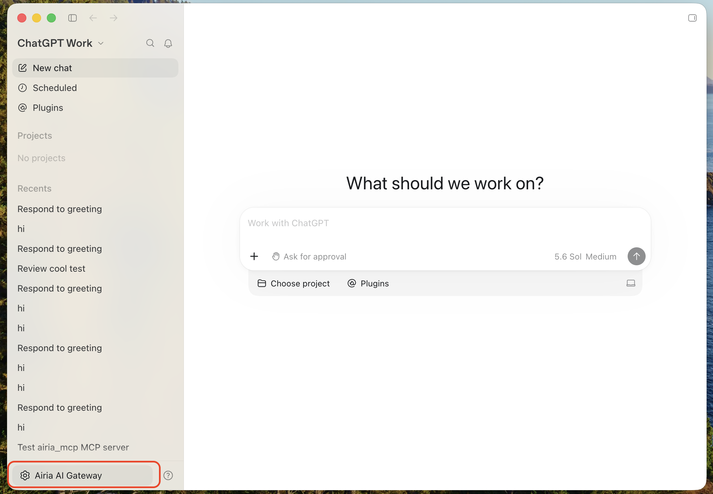
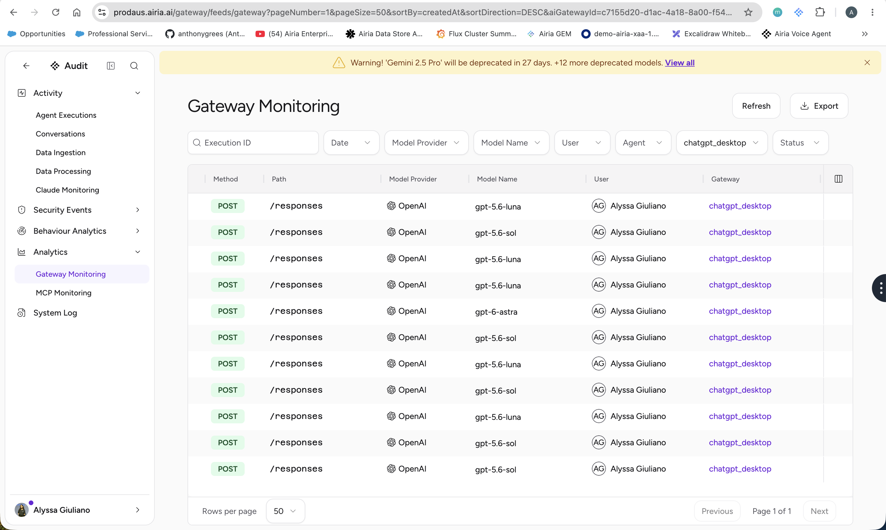

# Configuring Third Party Inference for ChatGPT Desktop (Work and Codex), and Codex CLI

Route model inference from **ChatGPT Desktop (Work and Codex)** and the **Codex CLI** through the Airia AI Gateway using a custom Codex model provider. All three surfaces read the same local configuration, so you complete this setup once and it applies everywhere.

**Inference path:** ChatGPT Desktop (Work / Codex) or Codex CLI → `~/.codex/config.toml` → Airia Gateway → `POST /openai/v1/responses`


## 1. Prerequisites & Routing Model

**Purpose:** Point ChatGPT Desktop (Work and Codex) and the Codex CLI at the Airia AI Gateway. This affects inference for these surfaces only — it does not change standard ChatGPT chat behavior elsewhere.

| Prerequisite | Detail |
|---|---|
| ChatGPT Desktop | Installed on macOS. The Codex workspace has been opened and initialized at least once. |
| Codex CLI | Installed and run at least once, so the `~/.codex` folder exists. |
| Airia access | A valid Airia bearer / API token. |
| Gateway endpoint | `https://prodaus.gateway.airia.ai/openai/v1` |
| Model ID | A model accepted by your Airia gateway. This guide uses `gpt-5.6-sol` as the example. |

**How it works:** ChatGPT Desktop (Work and Codex) and the Codex CLI all read `~/.codex/config.toml`. That file defines a custom provider (`airia`) whose token is supplied through the `AIRIA_API_KEY` environment variable rather than stored inline. Each surface resolves the token from the local environment when the provider is used, so the secret never lives in `config.toml`.

## 2. Update config.toml

### Open the configuration folder in Finder

1. Open **Finder**.
2. Press `⌘ Shift + G`.
3. Enter `~/.codex` and press **Go**.
4. If hidden items are not visible, press `⌘ Shift + .` to toggle them.
5. Open `config.toml` in TextEdit, VS Code, or any plain-text editor.

### Add the Airia provider block

Your `config.toml` may already contain settings written by ChatGPT Desktop or the Codex CLI (marketplace, plugin, MCP, desktop, project, and computer-use sections). **Leave all of those in place.**

**Add the following block at the very top of `config.toml`**, above any existing settings, then save:

```toml
model = "gpt-5.6-sol"
model_provider = "airia"
model_reasoning_effort = "medium"

[model_providers.airia]
name = "Airia AI Gateway"
base_url = "https://prodaus.gateway.airia.ai/openai/v1"
env_key = "AIRIA_API_KEY"
wire_api = "responses"
requires_openai_auth = false

# ── Existing settings generated by ChatGPT Desktop / Codex CLI ──
# (marketplace, plugin, MCP, desktop, project, computer-use, etc.)
# remain unchanged below this point.
```

**Key behavior:** `base_url` ends at `/openai/v1`; combined with `wire_api = "responses"`, every request is sent to `POST /openai/v1/responses`.

### Command-line alternative

Prefer the terminal? Open `config.toml` in a command-line editor, then paste the block at the top.

1. Make sure the folder exists and open the file in your editor:

   ```bash
   mkdir -p ~/.codex
   nano ~/.codex/config.toml     # or: vim ~/.codex/config.toml
   ```

2. Move the cursor to the very top of the file and paste the Airia block above any existing settings:

   ```toml
   model = "gpt-5.6-sol"
   model_provider = "airia"
   model_reasoning_effort = "medium"

   [model_providers.airia]
   name = "Airia AI Gateway"
   base_url = "https://prodaus.gateway.airia.ai/openai/v1"
   env_key = "AIRIA_API_KEY"
   wire_api = "responses"
   requires_openai_auth = false

   # ── Existing settings generated by ChatGPT Desktop / Codex CLI ──
   # (marketplace, plugin, MCP, desktop, project, computer-use, etc.)
   # remain unchanged below this point.
    ```

3. Save and exit. In **nano**, press `Control + O` then `Return` to save, and `Control + X` to exit. In **vim**, press `Esc`, type `:wq`, then `Return`.

Leave everything already in the file untouched — the Airia block simply sits above it.



## 3. Create the .env File

The provider reads the token from `AIRIA_API_KEY`. Store it in `~/.codex/.env`.

### Create it without the command line

1. Stay in the `~/.codex` folder in Finder.
2. Open **TextEdit** and choose **Format → Make Plain Text**.
3. Enter the line below, replacing the placeholder with your actual Airia token.
4. Save into `~/.codex` with the exact filename `.env`.

If TextEdit appends `.txt`, disable that behavior or rename the file so it is exactly `.env`.

`~/.codex/.env`:

```
AIRIA_API_KEY=YOUR_AIRIA_TOKEN
```

Store only the raw token value. Do not prepend `Bearer` unless your Airia configuration explicitly requires a nonstandard format.

Expected folder layout:

```
~/.codex/
├── config.toml
├── .env
├── computer-use/
├── plugins/
└── ...
```

Because `.env` starts with a dot, Finder may hide it. Press `⌘ Shift + .` to show hidden files.

### Command-line alternative

Write the token straight to `~/.codex/.env` from the terminal. Replace `YOUR_AIRIA_TOKEN` with your actual token:

```bash
mkdir -p ~/.codex
printf 'AIRIA_API_KEY=%s\n' 'YOUR_AIRIA_TOKEN' > ~/.codex/.env
chmod 600 ~/.codex/.env   # restrict to your user only
```

Using `printf` (rather than a text editor) avoids rich-text formatting and guarantees the filename is exactly `.env` with no `.txt` extension. `chmod 600` locks the file down so only your user account can read it.

**Verify it was written correctly:**

```bash
cat ~/.codex/.env        # should print: AIRIA_API_KEY=<your token>
ls -la ~/.codex/.env     # confirm the name is exactly .env
```

> **Tip:** To keep the token out of your shell history, add a leading space before the `printf` command (works when `HISTCONTROL=ignorespace` is set), or paste it interactively with `read -s`:
>
> ```bash
> read -rs AIRIA_TOKEN && printf 'AIRIA_API_KEY=%s\n' "$AIRIA_TOKEN" > ~/.codex/.env && unset AIRIA_TOKEN
> ```

## 4. Restart ChatGPT Desktop or Codex CLI

Save both `config.toml` and `.env`, then reload whichever surface you use:

- **ChatGPT Desktop:** Press `⌘Q` to fully quit — closing the window is not enough. Reopen the app, switch to the **Codex** workspace, and start a new session.
- **Codex CLI:** Exit the running `codex` process (or close the terminal), then start a new Codex CLI session so the updated `config.toml` and `.env` are reloaded.

## 5. Validate the Airia Connection



Once configured, ChatGPT Desktop should show **"Airia AI Gateway"** as the active model. If it does not appear, you may need to sign out and sign back in.

### Send a test prompt

1. Start a new session — in the ChatGPT Desktop workspace, or in the Codex CLI.
2. Send any ordinary prompt and confirm you get a response.
3. Note the approximate send time so the request is easy to find in Airia.

### Confirm in Airia

In Airia, go to **Audit → Gateway Monitoring** and find the request generated by your prompt. Confirm:

- **Request appears** — a recent log entry matches your prompt, whether sent from ChatGPT Desktop or the Codex CLI.
- **Correct route** — the request went through the configured OpenAI-compatible gateway endpoint.
- **Correct model** — the log shows the model ID.
- **Successful result** — the request completed without an authentication or gateway error.



## 6. Troubleshooting

| Symptom | Likely cause | Fix |
|---|---|---|
| Missing environment variable: `AIRIA_API_KEY` | `.env` is missing, misnamed, saved as rich text, or not loaded by the process. | Confirm `~/.codex/.env` exists, is not `.env.txt`, and contains `AIRIA_API_KEY=...`. Then fully restart ChatGPT Desktop or start a new Codex CLI session. |
| 401 / Unauthorized | Token is invalid, expired, wrong format, or the gateway expects a different auth mode. | Verify or refresh the token and confirm the gateway expects standard bearer authentication. |
| 404 on inference | The provider base URL or API path is incorrect. | Confirm the base URL is `https://prodaus.gateway.airia.ai/openai/v1` and the gateway exposes `/responses` beneath it. |
| Model not found / invalid model | The configured model is not available through Airia. | Set `model` to a model ID your gateway accepts. |
| Changes appear ignored | The app or CLI still holds the old session/config. | ChatGPT Desktop: quit with `⌘Q`, reopen, start a new Codex session. Codex CLI: exit and start a new session. |

**If `.env` still is not loaded:** as a diagnostic or workaround, set a process-level environment variable in macOS:

```
launchctl setenv AIRIA_API_KEY "YOUR_ACTUAL_AIRIA_TOKEN"
```

Then fully restart ChatGPT Desktop or start a new Codex CLI session. Avoid leaving long-lived credentials in process-level environment settings unless that matches your organization's credential policy.

## 7. Security Notes & Rollback

**Security**

- Never store the Airia token directly in `config.toml`.
- Never commit `.env` to source control.
- Treat tokens as user-specific credentials; rotate and revoke them per your organization's policy.
- This change affects Codex inference routing for ChatGPT Desktop and the Codex CLI only — standard ChatGPT conversations remain separate and unaffected.

**Rollback**

To restore the prior provider behavior across ChatGPT Desktop and the Codex CLI, remove or comment out:

```toml
model_provider = "airia"
```

You may keep or remove the `[model_providers.airia]` block. Fully restart ChatGPT Desktop or start a new Codex CLI session after the change.